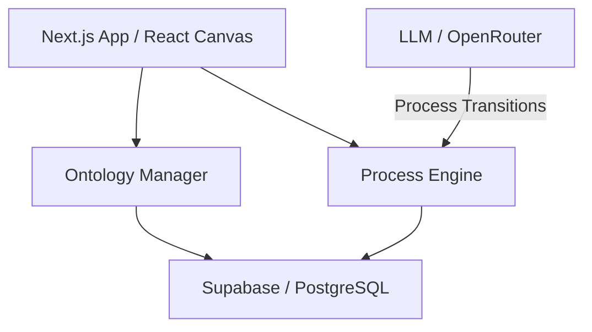

# Metaflow

Metaflow is an advanced workflow orchestration and ontology management platform designed to model, automate, and visualize complex business processes. It combines a flexible data ontology with a state-machine-driven process engine, allowing users to define intricate relationships and state-based transitions through an intuitive canvas.

## 🚀 Key Features

- **Ontology Management:** Define custom object types, properties, and complex relationships (Foreign Keys, etc.).
- **Visual Process Canvas:** Drag-and-drop interface for designing states, actions, and transitions.
- **Dynamic Action Execution:** Smart execution of actions based on object state and picklist configurations.
- **Workflow Automation:** Integrated agent-based loops and LLM integration for automated process transitions.
- **Multi-Tenant Architecture:** Secure tenant-based isolation for workspaces and data.

## 🏗️ Technical Architecture



**High-Level Flow:**
```
[ Define Ontology ] ──> [ Design Process Flow ] ──> [ Execute Actions ]
          │                         │                        │
          └─────────────────────────┼────────────────────────┘
                                    ▼
                        [ State Machine Engine ]
                                    ▼
                        [ Automated Process History ]
```

## 🛠️ Tech Stack

- **Frontend:** Next.js 15+ (App Router), TypeScript, Tailwind CSS, Lucide React
- **Process Visualization:** Custom React Flow-based canvas for ontology and process mapping
- **Backend/Database:** Supabase (Auth, PostgreSQL, Edge Functions)
- **AI Integration:** OpenRouter for LLM-powered workflow suggestions and transitions
- **State Management:** Custom hooks for ontology and process state

## 🏃 How to Run

### Prerequisites
- Node.js 20+
- Supabase account and CLI
- OpenRouter API Key (for AI features)

### Installation
```bash
# Clone the repository
git clone https://github.com/pavandongare/metaflow-app.git
cd metaflow-app

# Install dependencies
npm install
```

### Environment Setup
Create a `.env.local` file:
```
NEXT_PUBLIC_SUPABASE_URL=your_url
NEXT_PUBLIC_SUPABASE_ANON_KEY=your_key
OPENROUTER_API_KEY=your_key
```

### Database Setup
```bash
# Run the reset script to initialize schema (caution: clears data)
./supabase/reset-db.sh
```

### Development
```bash
# Start the development server
npm run dev
```

---
Built with ❤️ by [Pavan Dongare](https://github.com/pavandongare)
